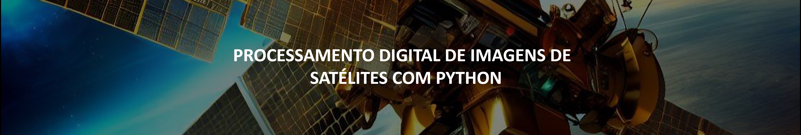

# Repositório de Processamento Digital de Imagens de Satélites com Python

Este repositório é dedicado ao processamento digital de imagens de satélites com Python e foi criado por João Ataíde, Cientista de Dados na Imagem Esri.

## Tecnologias

| Coluna 1    | Coluna 2      |
|-------------|---------------|
| Python      | Scipy         |
| rsgislib    | Numpy         |
| Py6S        | Matplotlib    |
| Spectral    | Scikit-learn  |
| Earthpy     |               |
| Rasterio    |               |
| Tifffile    |               |

## Projects
- [`install_libs_pdipython`](https://github.com/jvataidee/pdi_python/blob/master/install_libs_pdipython.ipynb): Notebook mostrando o passo a passo para instalar as bibliotecas e configuração de ambiente usandoo google colab.

## Repository Content
The repository contains various Jupyter notebooks related to the course.

## Additional Information
- No releases published
- No packages published
